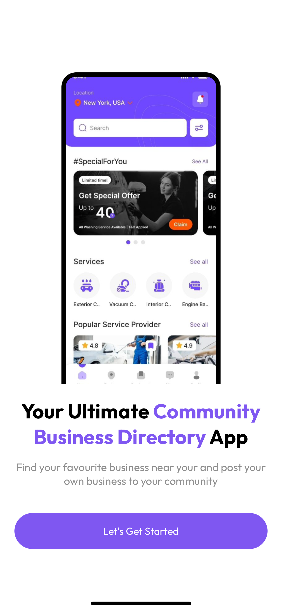
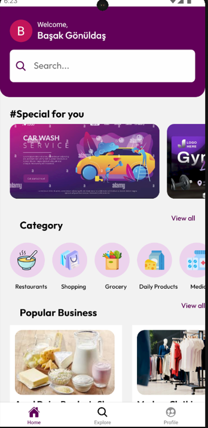
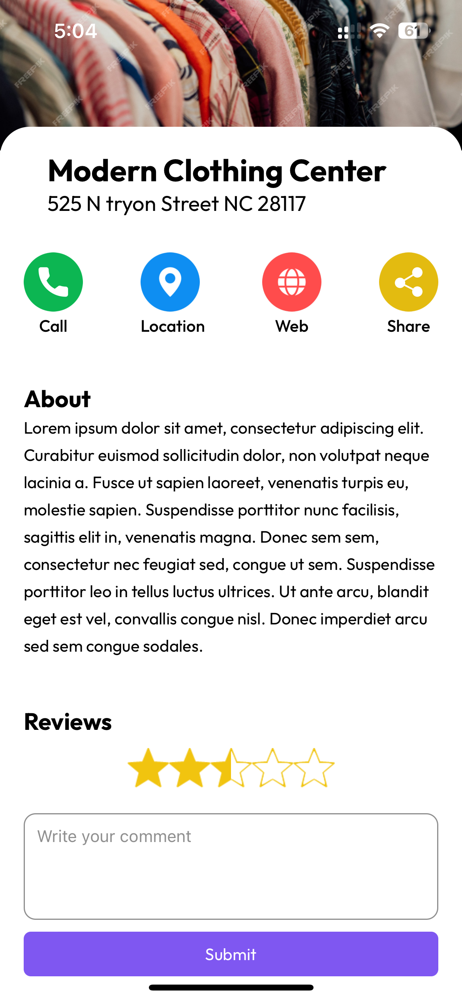
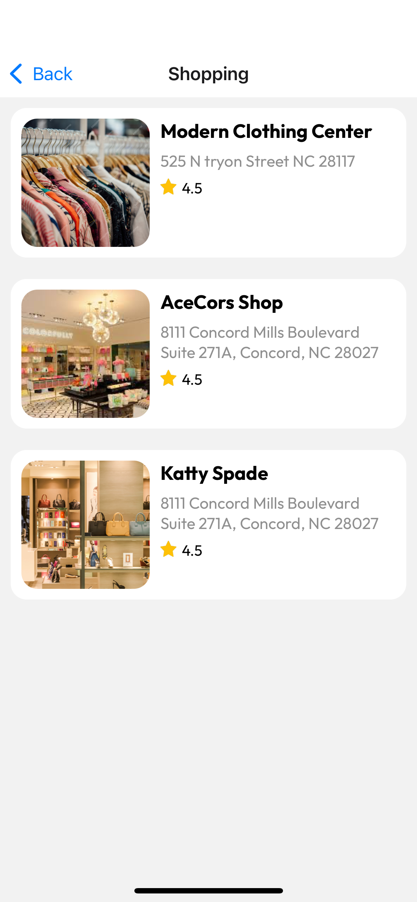
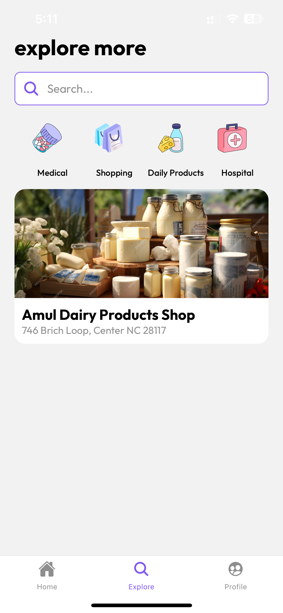
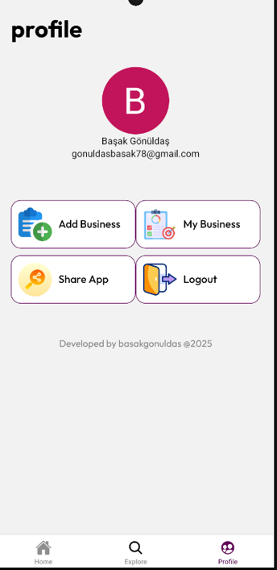

# 🏢📘 Business Directory App

A cross-platform mobile application built with **React Native** and **Firebase**, allowing users to **sign in**, **add**, **edit**, and **delete** business listings, and explore other services in their local community.

This app is designed to empower small businesses by providing them with visibility and easy access to potential customers through a clean, modern, and intuitive user experience.

---

## 🧭 Table of Contents

- [Features](#️✅-features)
- [Screenshots](#️🖼️-screenshots)
- [Tech Stack](#️⚙️-tech-stack)
- [Installation & Setup](#️🧰-installation--setup)
- [Project Structure](#️📁-project-structure)
- [Firebase Configuration](#️🔥-firebase-configuration)
- [Available Scripts](#️📜-available-scripts)
- [Future Enhancements](#️🚀-future-enhancements)
- [Developer](#️👨‍💻-developer)
- [License](#️📄-license)

---

## ✅ Features

- 🔐 **User Authentication**
  - Google Sign-In with Firebase Authentication
- 🧾 **Business Listings**
  - Create, view, edit, and delete business profiles
- 📸 **Image Upload**
  - Upload and display business images via Firebase Storage
- 🗂️ **Categorization**
  - Organize businesses by custom categories
- 🔎 **Search**
  - Real-time search functionality for faster discovery
- 👤 **User Profile**
  - View personal listings, edit details, and manage account
- 📤 **App Sharing**
  - Share app via native device sharing options
- 📱 **Responsive UI**
  - Smooth and modern mobile interface with optimized UX

---

## 🖼️ Screenshots

<table>
  <tr>
    <th>Splash Screen</th>
    <th>Home Screen</th>
    <th>Businesses Screen</th>
  </tr>
  <tr>
    <td></td>
    <td></td>
    <td></td>
  </tr>
</table>

<br/>

<table>
  <tr>
    <th>Category Screen</th>
    <th>Explore Screen</th>
    <th>Profile Screen</th>
  </tr>
  <tr>
    <td></td>
    <td></td>
    <td></td>
  </tr>
</table>

---

## ⚙️ Tech Stack

| Technology / Library             | Description                                 |
|----------------------------------|---------------------------------------------|
| **React Native (Expo)**          | Core framework for building native apps     |
| **Expo Router**                  | Routing and screen navigation               |
| **Firebase Firestore**           | Cloud NoSQL database for storing business data |
| **Firebase Authentication**      | User authentication with Google Sign-In     |
| **Firebase Storage**             | Uploading and hosting business images       |
| **React Native Image Picker**    | Selecting images from device gallery        |
| **React Context API**            | App-wide state management (auth, user info) |
| **NativeBase / React Native Paper** | Pre-designed UI components for faster dev |

---

## 🧰 Installation & Setup

### 🔁 Prerequisites

Before you begin, ensure you have the following:

- ✅ [Node.js](https://nodejs.org/) (v16 or higher)
- ✅ [Expo CLI](https://docs.expo.dev/get-started/installation/)
- ✅ A [Firebase project](https://console.firebase.google.com/) with:
  - Authentication enabled (Google Sign-In)
  - Firestore database set up
  - Firebase Storage enabled

### 📦 Installation

```bash
# 1. Clone the repository
git clone https://github.com/your-username/community-directory-app.git
cd community-directory-app

# 2. Install dependencies
npm install

# 3. Start the development server
npx expo start
